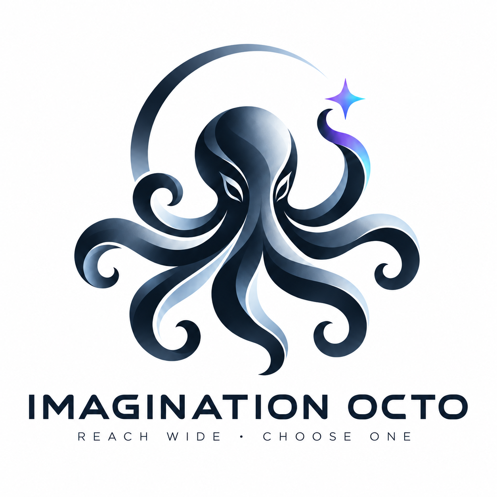

<div align="center">

<picture>
  <source media="(prefers-color-scheme: dark)" srcset="assets/brand/imagination-octo-logo-dark.png" />
  
</picture>

# IMAGINATION OCTO

**REACH WIDE · CHOOSE ONE**

### Un plugin creativo con la persona en el circuito para Claude Code y Codex —<br/>primero ideas distintas, después tu elección, al final un concepto puesto a prueba

[English](README.md) · [한국어](README.ko.md) · [日本語](README.ja.md) · [简体中文](README.zh-CN.md) · [Español](README.es.md) · [Français](README.fr.md) · [Deutsch](README.de.md) · [Português (Brasil)](README.pt-BR.md)

[](https://github.com/djfksjd/imagination-octo/actions/workflows/tests.yml)
[](LICENSE)


</div>

Imagination Octo se extiende en varias direcciones a la vez y luego se detiene. Devuelve un pequeño portafolio de ideas que difieren en su mecanismo, no en su redacción, y termina el turno. Solo cuando eliges una la pone a prueba y la desarrolla. La decisión es lo único que se niega a automatizar.

**Esto es `v0.5 beta`.** La tabla de abajo proviene de un solo modelo (`gpt-5.4`), evaluado por llamadas de IA de la misma familia, sobre un conjunto pequeño de briefs. Después se hizo un experimento con GPT y Claude, pero su resultado de preferencia queda anulado hasta que se vuelva a juzgar; consulta *Léelas con honestidad*. Nada de esto afirma una creatividad universal.

## Qué hace

| | |
|---|---|
| **Portafolio divergente** | 3–5 direcciones construidas con tres pasadas: directa, transferencia de mecanismos y cambio de premisa. Se descartan las variantes que solo cambian de nombre o de tema. |
| **El ajuste es un veto** | Una idea que debilita un requisito innegociable se descarta, por sorprendente que sea. Una infracción con otro nombre sigue siendo una infracción. |
| **Tú eliges** | El enrutador nunca elige y desarrolla en el mismo turno. El encadenamiento automático redujo el ajuste a las restricciones en las pruebas, así que la pausa es obligatoria. |
| **Prueba de presión** | La idea elegida se enfrenta a su supuesto de carga, a su competidor convencional más simple y al fallo que provoca su propio mecanismo. |
| **Fracaso honesto** | Si la respuesta convencional es mejor, o la dirección no sobrevive, lo dice y te devuelve a divergir. |
| **Runtime pequeño** | Tres archivos de skill. Sin mazos, listas de prohibición, compuertas ni scripts en ejecución; alrededor de 1,1× los tokens de un prompt normal en las pruebas. |

## Cómo funciona

```text
 your brief ──► ┌──────── diverge · imagination-octo-engine ─────────┐
                │  direct pass · mechanism transfer · premise shift  │
                │    cull by failure · private proof per survivor    │
                └──────────────────────────┬─────────────────────────┘
                                           ▼
                               3–5 distinct directions
                                           ▼
                                    ◆ YOU CHOOSE ◆        the turn always ends here
                                           ▼
                ┌───── develop · imagination-octo-brainstorming ─────┐
                │ load-bearing assumption · conventional competitor  │
                │   native failure mode · boring half · falsifier    │
                └──────────────────────────┬─────────────────────────┘
                                           ▼
                             decision-ready concept memo
```

- La pausa entre las dos mitades es parte del método, no un detalle de interfaz.
- La búsqueda y la prueba son privadas. Recibes las ideas, no un informe de que se ejecutó un pipeline.
- No se implementa nada. El resultado es un concepto que puedes llevar a planificación.

## Inicio rápido

```bash
curl -fsSL https://raw.githubusercontent.com/djfksjd/imagination-octo/main/install.sh | bash
```

Para actualizar, ejecuta el mismo comando otra vez. Si avisa de copias antiguas de estas skills instaladas por separado, termina el comando con `| bash -s -- --clean-legacy` para apartarlas; no se borra nada.

Luego pide:

```text
Usa $imagination-octo para inventar varias mecánicas de negociación para un juego
narrativo sin árboles de diálogo, dados ocultos ni estadística de persuasión.
```

En `codex exec` o en un script, Codex solo reconoce el nombre completo: `$imagination-octo:imagination-octo`.

La primera respuesta termina con una elección. Responde con un número o una dirección:

```text
Desarrolla la opción 2.
```

## Un plugin, tres skills

| Skill | Ideal para | Devuelve |
|---|---|---|
| `$imagination-octo` | La mayoría de las peticiones | Portafolio → tu elección → concepto desarrollado |
| `$imagination-octo-engine` | Solo divergencia | 3–5 direcciones útiles y no obvias |
| `$imagination-octo-brainstorming` | Una idea que ya elegiste | Un memo de concepto listo para decidir |

## Mediciones (2026-07-30)

Comparaciones ciegas prerregistradas contra un prompt normal sólido. 10 briefs nuevos en inglés y coreano, 5 ejecuciones por condición, 5 jueces.

| Runtime | Preferido para continuar | Mayores mejoras (escala 1–7) | Tokens |
|---|---|---|---|
| Engine v0.5.3 | **50–0 (100,0 %)** | sorpresa útil `+0.97` · diversidad `+0.66` · ajuste `+0.60` | 1,12× |
| Concept Workshop v0.4.2 | **45–5 (90,0 %)** | accionabilidad `+1.37` · ajuste `+0.95` · robustez `+0.82` | 1,14× |

Léelas con honestidad:

- **Solo `gpt-5.4` generó y juzgó.** Aún no hay ejecuciones con Claude ni jueces humanos. Los jueces de la misma familia pueden compartir su gusto.
- **Diez briefs son una distribución pequeña.** Intervalos de Wilson al 95 %: Engine 92,9–100,0 %, Workshop 78,6–95,7 %.
- **Puede perder.** Un brief del Workshop fue por unanimidad para el prompt normal, y una versión anterior del Engine perdió igual un brief de drama.
- **Un diseño anterior fracasó por completo.** El pipeline de mazos y compuertas (Engine v0.4.0) perdió 0–30 contra un prompt normal con 48× el coste y fue reemplazado. Ese registro se conserva en el repositorio del Engine.
- **Experimento A (2026-10-06): resultado de preferencia anulado por ahora.** Un experimento prerregistrado entre modelos ([regla](evals/PREREGISTRATION.md), [resultado](evals/results/2026-10-06-experiment-a.md)) con 12 briefs nuevos, generados por `gpt-5.5` y `claude-opus-5-5` y juzgados por la otra familia. El motor fue preferido al prompt normal en 11 de 12 briefs con GPT y en 10 de 12 con Claude, y un prompt normal con el mismo esfuerzo no cerró la diferencia. Pero los jueces adivinaron qué lado usaba la skill en 22 de 24 pruebas con cada modelo, así que, según la regla fijada de antemano, estas cifras de preferencia no cuentan hasta normalizar el formato de las salidas y volver a juzgarlas. La comprobación a ciegas del autor también sigue pendiente. No afectado por eso: con el motor, ejecuciones separadas repitieron menos los mismos mecanismos (solapamiento 0,40 frente a 0,54 con GPT; 0,50 frente a 0,63 con Claude), con 1,08× los tokens en GPT y 1,99× en Claude.
- **Una candidata v0.6.0 falló (2026-10-06).** Intentaba ampliar los portafolios y reducir la repetición. En 12 briefs nuevos no superó a la v0.5.3 (5–5–2 con GPT, 4–6–2 con Claude) y no pasó los umbrales prerregistrados en ninguno de los dos, así que se mantiene la v0.5.3 ([resultado](evals/results/2026-10-06-experiment-b.md)).
- **El motor v0.7.0 pasó (2026-10-07).** Da a cada pasada de búsqueda su propio contexto nuevo. En 12 briefs nuevos fue preferido a la v0.5.3 en 11 con GPT y en 10 con Claude, con la sorpresa útil subiendo +0,44 y +0,29, con 3,9× y 3,3× los tokens ([regla](evals/PREREGISTRATION-C.md), [resultado](evals/results/2026-10-07-experiment-c.md)). Según nuestra codificación sus mecanismos no fueron más raros, así que la ganancia está en ideas mejor elegidas más que en ideas más extrañas. Lo juzgó la otra familia de modelos, no personas.
- **Flujo de dos turnos:** solo se comprobó el comportamiento. Una suite de regresión pasó 13 de 14 casos; el fallo, una elección adivinada cuando la respuesta encajaba con dos direcciones, llevó a corregir el router. No hay estudio de preferencia del flujo completo.

Protocolos, reglas de decisión y archivos de resultados: [Imagination Octo Engine](https://github.com/djfksjd/imagination-octo-engine) · [Imagination Octo Brainstorming](https://github.com/djfksjd/imagination-octo-brainstorming).

## Cuándo usarlo y cuándo no

**Úsalo** cuando quieras opciones que de verdad difieran: conceptos, premisas, mecánicas, productos, servicios, mundos, rituales, o cuando las ideas anteriores resultaron genéricas.

**Usa un prompt normal** para preguntas factuales, implementación rutinaria, solo nombres, o cualquier caso en que la respuesta convencional sea la correcta.

## Registro de elecciones (opcional)

Desactivado por defecto. Al activarlo, cada vez que eliges una dirección o rechazas un portafolio se añade una línea a `~/.imagination-octo/choices.jsonl` en tu equipo: las direcciones mostradas, tu elección y el motivo que hayas dado. Los briefs se guardan como hash salvo que pidas el texto. No se sube nada y las skills nunca leen el registro; existe para que puedas estudiar tus propias elecciones. `enable --hosts` añade una línea marcada a tu `CLAUDE.md` / `AGENTS.md` global para que la skill vea la activación, y `disable` la quita.

```bash
LOG=https://raw.githubusercontent.com/djfksjd/imagination-octo/main/skills/imagination-octo/scripts/choice_log.py
curl -fsSL $LOG | python3 - enable --hosts claude,codex   # --with-brief keeps the brief text
curl -fsSL $LOG | python3 - stats
curl -fsSL $LOG | python3 - disable
```

## Antes se llamaba `imagination`

Este plugin y su skill enrutadora se llamaban `imagination` hasta la v0.1.3. GitHub redirige la URL antigua del repositorio, pero el nombre del plugin y el comando del enrutador cambiaron: elimina el plugin `imagination` antiguo, instala `imagination-octo` e invoca `$imagination-octo`. Desde la v0.4 las dos skills especializadas y sus repositorios también llevan el nombre de la familia: `$imagination-octo-engine` y `$imagination-octo-brainstorming` sustituyen a `$imagination-engine` y `$imagination-brainstorming`. Desde la v0.3 también cambió el id del marketplace, de `djfksjd` a `imagination-octo`, porque el anterior chocaba con otros plugins del mismo autor. El destino de instalación es ahora `imagination-octo@imagination-octo`.

## Instalación manual

```bash
# Claude Code
claude plugin marketplace add djfksjd/imagination-octo
claude plugin install imagination-octo@imagination-octo

# Codex
codex plugin marketplace add djfksjd/imagination-octo
codex plugin add imagination-octo@imagination-octo
```

## Desarrollo

Los runtimes especializados se mantienen y evalúan en sus propios repositorios. Antes de publicar, sincroniza sus `SKILL.md`, valida las tres skills, ejecuta las pruebas del repositorio y prueba hacia adelante el límite de dos turnos.

```bash
python3 -m pytest tests/ -q
bash -n install.sh
```

## Licencia

[MIT](LICENSE).
