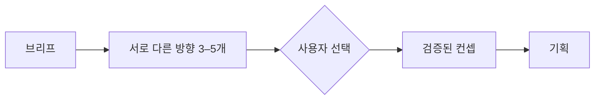

<div align="center">

# ✨ Imagination

**서로 다른 아이디어를 만들고, 직접 선택하고, 살아남은 방향을 발전시키세요.**

Codex와 Claude Code를 위한 사람 중심 창의성 플러그인입니다.

[](https://github.com/djfksjd/imagination/actions/workflows/tests.yml)


[English](README.md) · [한국어](README.ko.md) · [日本語](README.ja.md) · [简体中文](README.zh-CN.md) · [Español](README.es.md) · [Français](README.fr.md) · [Deutsch](README.de.md) · [Português (Brasil)](README.pt-BR.md)

</div>

---

Imagination은 AI가 자동화하면 안 되는 부분, 즉 **선택**을 사용자에게
남깁니다. 먼저 인과적으로 다른 방향들을 만들고, 사용자가 고른 뒤에만 그
아이디어를 검증하고 구체화합니다.



## 빠른 시작

```bash
curl -fsSL https://raw.githubusercontent.com/djfksjd/imagination/main/install.sh | bash
```

```text
$imagination을 사용해서 대화 트리, 숨은 주사위, 설득 능력치 없이 작동하는
게임 협상 메커니즘을 여러 개 만들어 줘.
```

첫 응답의 후보 중 하나를 고르면 됩니다.

```text
2번을 발전시켜 줘.
```

## 하나의 플러그인, 세 개의 스킬

| 스킬 | 권장 상황 | 결과 |
|---|---|---|
| `$imagination` | 대부분의 사용자 | 아이디어 포트폴리오 → 사용자 선택 → 컨셉 |
| `$imagination-engine` | 아이디어 발산만 필요할 때 | 쓸모 있고 비자명한 방향 3–5개 |
| `$imagination-brainstorming` | 이미 고른 아이디어가 있을 때 | 의사결정 가능한 컨셉 메모 |

> [!IMPORTANT]
> 라우터는 같은 턴에 아이디어를 고르고 발전시키지 않습니다. 자동 연쇄는
> 테스트에서 제약 적합성을 낮췄기 때문에 사용자 선택을 필수 경계로 둡니다.

## 측정 결과

강한 일반 프롬프트와 새 사전 등록 블라인드 비교를 진행했습니다.

| 런타임 | 선호 결과 | 주요 향상 |
|---|---:|---|
| Engine v0.5.3 | **50 대 0 (100.0%)** | 유용한 의외성 `+0.97`, 다양성 `+0.66`, 적합성 `+0.60` |
| Concept Workshop v0.4.2 | **45 대 5 (90.0%)** | 실행 가능성 `+1.37`, 적합성 `+0.95`, 인과적 명료성 `+0.71`, 견고성 `+0.82` |

이는 테스트한 작업 분포에서 같은 모델 계열 심사자가 평가한 결과이며 모든
창의적 작업에서의 보편적 우월성을 뜻하지 않습니다. 전체 프로토콜은
[Imagination Engine](https://github.com/djfksjd/imagination-engine-skill)과
[Imagination Brainstorming](https://github.com/djfksjd/imagination-brainstorming-skill)에
있습니다.

## 수동 설치

```bash
# Claude Code
claude plugin marketplace add djfksjd/imagination
claude plugin install imagination@djfksjd

# Codex
codex plugin marketplace add djfksjd/imagination
codex plugin add imagination@djfksjd
```

## 설계 원칙

- 새로움은 브리프를 강화해야 합니다.
- 아이디어 생성과 발전 사이에는 사용자의 선택이 필요합니다.
- 이름만 바꾼 제약 위반도 위반으로 처리합니다.
- 선택안이 성립하지 않으면 솔직하게 중단합니다.
- 실제 결과를 개선하는 지침만 런타임에 남깁니다.

## 개발

릴리스 전 전문 스킬 동기화, 세 스킬 검증, 저장소 테스트와 두 턴 선택 경계
전방 테스트를 실행합니다.

```bash
python3 -m pytest tests/ -q
bash -n install.sh
```

MIT 라이선스입니다.
