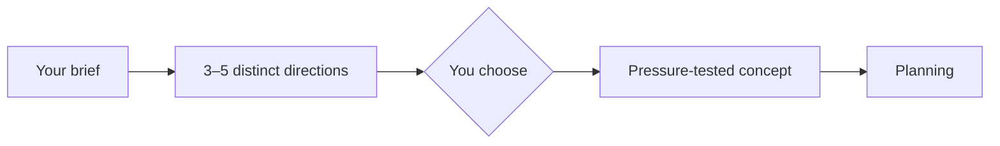

<div align="center">

# ✨ Imagination

**Generate distinct ideas. Choose with intent. Develop what survives.**

One human-in-the-loop creative plugin for Codex and Claude Code.

[](https://github.com/djfksjd/imagination/actions/workflows/tests.yml)


[English](README.md) · [한국어](README.ko.md) · [日本語](README.ja.md) · [简体中文](README.zh-CN.md) · [Español](README.es.md) · [Français](README.fr.md) · [Deutsch](README.de.md) · [Português (Brasil)](README.pt-BR.md)

</div>

---

Imagination keeps the part AI should not automate: **the decision**. It first
creates a portfolio of genuinely different directions, waits for you to choose,
then pressure-tests only the selected idea.



## Quick start

```bash
curl -fsSL https://raw.githubusercontent.com/djfksjd/imagination/main/install.sh | bash
```

Then ask:

```text
Use $imagination to invent several negotiation mechanics for a narrative game
without dialogue trees, hidden dice, or a persuasion stat.
```

The first response ends with a choice. Reply with a number or direction:

```text
Develop option 2.
```

## One plugin, three skills

| Skill | Best for | Returns |
|---|---|---|
| `$imagination` | Most users | Portfolio → your choice → developed concept |
| `$imagination-engine` | Direct divergence | 3–5 useful, non-obvious directions |
| `$imagination-brainstorming` | An idea already chosen | A decision-ready concept memo |

> [!IMPORTANT]
> The router never chooses and develops an idea in the same turn. Automatic
> chaining reduced constraint fit in testing, so your choice remains the hard
> boundary between divergence and development.

## Measured results

Fresh preregistered blind comparisons against strong plain prompts:

| Runtime | Preference | Largest measured gains |
|---|---:|---|
| Engine v0.5.2 | **25–5 (83.3%)** | useful surprise `+0.98`, diversity `+0.93`, fit `+0.31` |
| Concept Workshop v0.4.1 | **25–5 (83.3%)** | actionability `+1.37`, fit `+0.59`, causal clarity `+0.59` |

These are model-judge results from the tested task distribution, not a claim of
universal creativity. See the full protocols and limitations in
[Imagination Engine](https://github.com/djfksjd/imagination-engine-skill) and
[Imagination Brainstorming](https://github.com/djfksjd/imagination-brainstorming-skill).

## Manual install

```bash
# Claude Code
claude plugin marketplace add djfksjd/imagination
claude plugin install imagination@djfksjd

# Codex
codex plugin marketplace add djfksjd/imagination
codex plugin add imagination@djfksjd
```

## Design principles

- **Useful surprise:** novelty must strengthen the brief, not replace it.
- **Human choice:** generation and development are separate decisions.
- **Constraint fidelity:** renamed or indirect violations still count.
- **Honest failure:** the workshop may reject a direction that does not survive.
- **Small runtime:** the creative context contains only what improves the result.

## Development

The specialist runtimes are maintained and evaluated in their own repositories.
Before a release, synchronize their `SKILL.md` files, validate all three skills,
run the repository tests, and forward-test the two-turn boundary.

```bash
python3 -m pytest tests/ -q
bash -n install.sh
```

MIT licensed.
